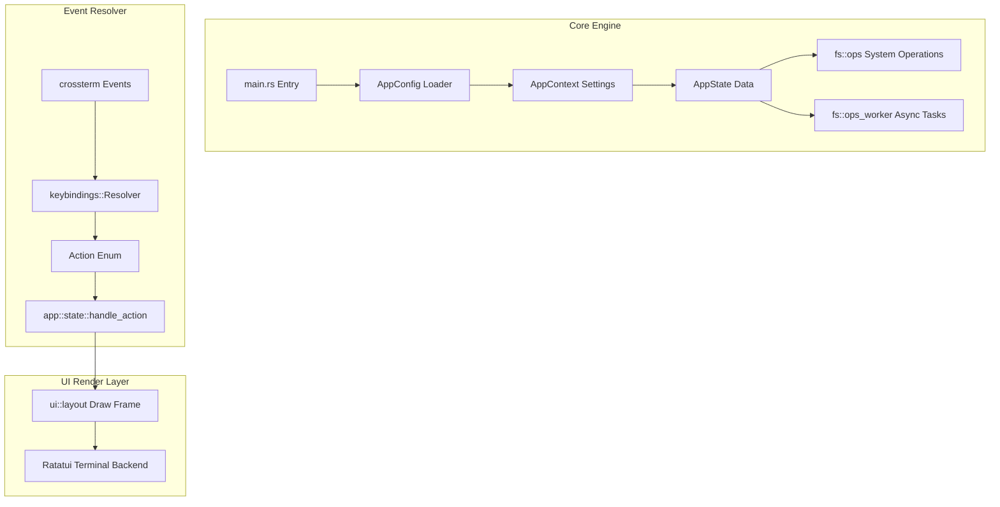
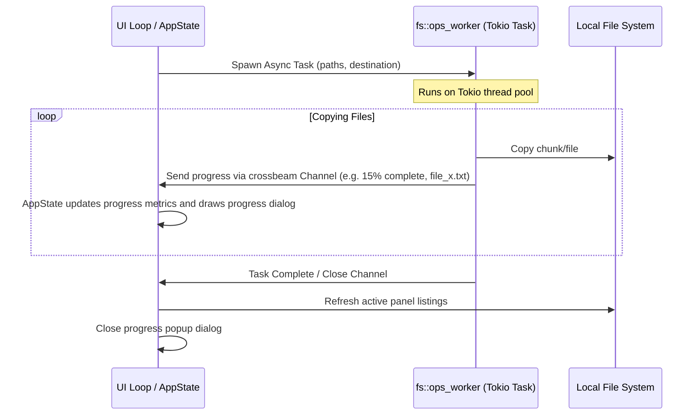

# NCRust Developer & Architecture Manual

This document details the software design, structure, runtime workflows, and code patterns utilized within the **NCRust** terminal file manager.

---

## 🏛️ 1. Core Architecture & Decoupled State

NCRust is built on the core principle of **separating core application logic from the presentation (UI) layer**. 



### 1.1 Decoupled Terminal State
The core business logic does not import `ratatui` or handle console outputs directly.
* All directory listings, glob filtering, active operations state, selected files lists, and background tasks channels are housed inside `AppState` (`src/app/state/mod.rs`) and `AppContext` (`src/app/context.rs`).
* This enables writing standard Rust unit tests for directory changes, sorting options, and path manipulations without mocking terminal devices.

### 1.2 The Event Loop (`app::run`)
The main execution sequence:
1. `main.rs` builds `AppContext` and `AppState`.
2. `app::run()` starts terminal raw mode using `terminal::backend`.
3. An asynchronous loop listens for terminal resize and key inputs via `terminal::events`.
4. Resolved inputs mutate state parameters and trigger corresponding filesystem changes.
5. The TUI drawing layer renders the modified status on every loop tick.

---

## ⌨️ 2. Keybinding Resolution Engine

NCRust supports custom presets (`norton`, `vim`, `modern`) without bloating UI components with key listener logic.

### 2.1 Event Flow
Keyboard event processing follows a strict unidirectional flow:
1. `crossterm::event::KeyEvent` is captured by the background event producer.
2. The key event is sent to the resolver: `keybindings::resolver::resolve(key, active_preset)`.
3. The resolver returns a logical `keybindings::actions::Action` variant.
4. The action is handled by the application state handler: `app::state::handle_action(action)`.

```rust
// Logical mapping example from keybindings/resolver.rs
pub fn resolve(key: KeyEvent, preset: &str) -> Option<Action> {
    match preset {
        "vim" => resolve_vim_preset(key),
        "norton" => resolve_norton_preset(key),
        _ => resolve_modern_preset(key),
    }
}
```

---

## 🔄 3. Asynchronous Operations & Worker Pattern

For long-running disk operations (Copy, Move, Wipe, Delete), blocking the main rendering loop causes the UI to freeze. NCRust solves this by delegating heavy disk tasks to a background thread pool managed by `tokio`.



### 3.1 Progress Channel Lifecycle
* **Task Spawning:** When `Action::Copy` is resolved, `fs::ops_worker::spawn_copy_task` is triggered.
* **Worker Execution:** A background thread handles file enumeration, path checks, read/write loops, and system calls.
* **Progress Reporting:** The worker sends `CopyProgress` updates via a channel sender. The structure reports:
  ```rust
  pub struct CopyProgress {
      pub current_file: String,
      pub files_copied: usize,
      pub total_files: usize,
      pub bytes_copied: u64,
      pub total_bytes: u64,
  }
  ```
* **UI Redraw:** On each tick, the main UI thread drains outstanding updates from the channel receiver into the state variables. If a background operation is active, `ui::popup::prompts::render_prompt_popup` displays a dynamic progress bar widget.

---

## 🌐 4. Centralized Localization & Translations

Translations are handled systematically to prevent code redundancy and hardcoded UI string issues.
* **English Strings:** All default English UI text labels are defined centrally in `src/config/localization/en.rs` using `get_default_english_translation(key)`.
* **External Translations:** Non-English languages are loaded dynamically from JSON profiles (e.g., `lang/es.json`) located in the application runtime directory.
* **Translation Helper:** Code files utilize `t("translation_key")` to resolve messages. If a localized file is missing, the engine falls back to default English definitions.

---

## 🖥️ 5. Standalone Terminal Launcher

To support launching NCRust as a desktop app without an open parent terminal session:
* On startup, `main.rs` invokes `terminal::standalone::check_and_launch_standalone()`.
* **Windows Behavior:** The program detects if it was launched from explorer (no parent console attached). If so, it invokes a new shell wrapper (e.g., `cmd.exe` or `powershell.exe`) with the necessary window parameters, hosting the NCRust executable.
* **Linux/macOS Behavior:** Spins up a default system terminal emulator (e.g., `xterm`, `gnome-terminal`, `kitty`) to launch the application.

---

## 🎨 6. Theme Engine & Colors

* Themes are styled via individual TOML profile documents.
* Themes map logical UI elements (e.g. `panel_border`, `file_executable`, `menu_selected`) to terminal-friendly color palettes (e.g. `Color::Blue`, `Color::Rgb(r,g,b)`).
* `ui::theme_apply::parse_color` interprets the TOML strings, translating them into `ratatui::style::Color` rules applied directly during frame draws.
