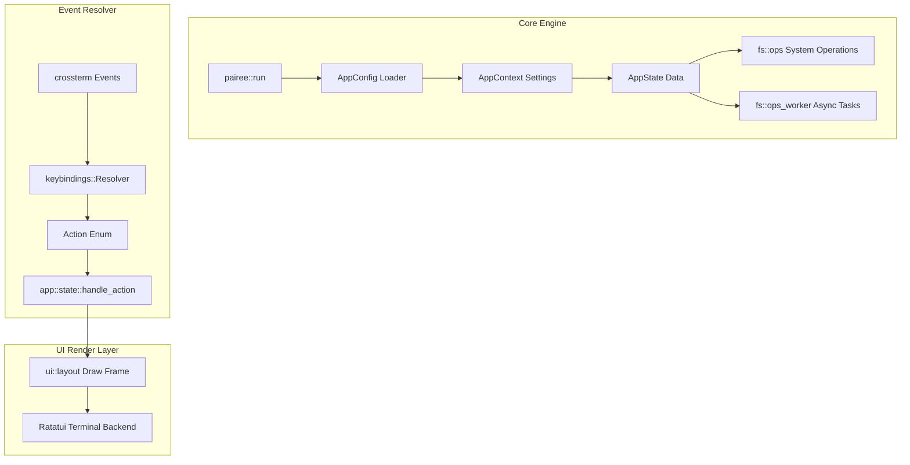
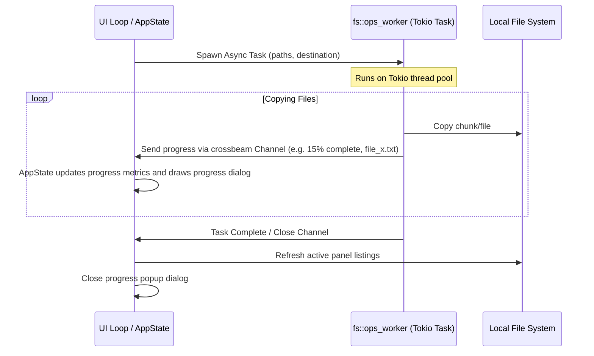

# Pairee Developer & Architecture Manual

This document details the software design, structure, runtime workflows, and code patterns utilized within the **Pairee** terminal file manager.

---

## 🏛️ 1. Core Architecture & Decoupled State

Pairee is built on the core principle of **separating core application logic from the presentation (UI) layer**. 


```mermaid
graph TD
    subgraph Core Engine
        A[pairee::run] --> B[AppConfig Loader]
        B --> C[AppContext Settings]
        C --> D[AppState Data]
        D --> E[fs::ops System Operations]
        D --> F[fs::ops_worker Async Tasks]
    end
    subgraph Event Resolver
        G[crossterm Events] --> H[keybindings::Resolver]
        H --> I[Action Enum]
        I --> J[app::state::handle_action]
    end
    subgraph UI Render Layer
        J --> K[ui::layout Draw Frame]
        K --> L[Ratatui Terminal Backend]
    end
```

### 1.1 Decoupled Terminal State
The core business logic does not import `ratatui` or handle console outputs directly.
* All directory listings, glob filtering, active operations state, selected files lists, and background tasks channels are housed inside `AppState` (`src/app/state/mod.rs`) and `AppContext` (`src/app/context.rs`).
* This enables writing standard Rust unit tests for directory changes, sorting options, and path manipulations without mocking terminal devices.

### 1.2 The Event Loop (`app::run`)
The main execution sequence:
1. `src/main.rs` is a thin `#[tokio::main]` wrapper; `pairee::run` (`src/run.rs`) builds `AppContext` and `AppState`.
2. `app::run()` starts terminal raw mode using `terminal::backend`.
3. An asynchronous loop listens for terminal resize and key inputs via `terminal::events`.
4. Resolved inputs mutate state parameters and trigger corresponding filesystem changes.
5. The TUI drawing layer paints when the dirty flag is set (DEC 2026 synchronized update; full-screen clear only on resize or screen-mode restore).

---

## ⌨️ 2. Keybinding Resolution Engine

Pairee supports custom presets (`norton`, `vim`, `modern`) without bloating UI components with key listener logic.

### 2.1 Event Flow
Keyboard event processing follows a strict unidirectional flow:
1. `crossterm::event::KeyEvent` is captured by the background event producer.
2. The key event is sent to the resolver: `keybindings::resolver::resolve(key, active_preset)`.
3. The resolver returns a logical `keybindings::actions::Action` variant.
4. The action is handled by the application state handler: `app::state::handle_action(action)`.

```rust
// Logical mapping example from keybindings/resolver.rs
pub fn resolve(key: KeyEvent, preset: &str) -> Option<Action> {
    match preset {
        "vim" => resolve_vim_preset(key),
        "norton" => resolve_norton_preset(key),
        _ => resolve_modern_preset(key),
    }
}
```

---

## 🔄 3. Asynchronous Operations & Worker Pattern

For long-running disk operations (Copy, Move, Wipe, Delete), blocking the main rendering loop causes the UI to freeze. Pairee solves this by delegating heavy disk tasks to a background thread pool managed by `tokio`.


```mermaid
sequenceDiagram
    participant UI as UI Loop / AppState
    participant Worker as fs::ops_worker (Tokio Task)
    participant OS as Local File System

    UI->>Worker: Spawn Async Task (paths, destination)
    Note over Worker: Runs on Tokio thread pool
    loop Copying Files
        Worker->>OS: Copy chunk/file
        Worker->>UI: Send progress via crossbeam Channel (e.g. 15% complete, file_x.txt)
        UI->>UI: AppState updates progress metrics and draws progress dialog
    end
    Worker->>UI: Task Complete / Close Channel
    UI->>OS: Refresh active panel listings
    UI->>UI: Close progress popup dialog
```

### 3.1 Progress Channel Lifecycle
* **Task Spawning:** When `Action::Copy` is resolved, `fs::ops_worker::spawn_copy_task` is triggered.
* **Worker Execution:** A background thread handles file enumeration, path checks, read/write loops, and system calls.
* **Progress Reporting:** The worker sends `CopyProgress` updates via a channel sender. The structure reports:
  ```rust
  pub struct CopyProgress {
      pub current_file: String,
      pub files_copied: usize,
      pub total_files: usize,
      pub bytes_copied: u64,
      pub total_bytes: u64,
  }
  ```
* **UI Redraw:** On each tick, the main UI thread drains outstanding updates from the channel receiver into the state variables. If a background operation is active, `ui::popup::prompts::render_prompt_popup` displays a dynamic progress bar widget.

---

## 🌐 4. Centralized Localization & Translations

Translations are handled systematically to prevent code redundancy and hardcoded UI string issues.
* **English Strings:** All default English UI text labels are defined centrally in the embedded [en.toml](file:///d:/GitHub/NCRust/lang/en.toml) file, resolved via `get_default_english_translation(key)`.
* **External & Embedded Translations:** Non-English languages (like Spanish) are compiled directly into the binary ([es.toml](file:///d:/GitHub/NCRust/lang/es.toml)) for portability, and can be overridden dynamically by external TOML files in the `lang/` directory at startup.
* **Translation Helper:** Code files utilize `t("translation_key")` to resolve messages. If a localized file is missing, the engine falls back to default English definitions.

---

## 🖥️ 5. Standalone Terminal Launcher

To support launching Pairee as a desktop app without an open parent terminal session:
* On startup, `pairee::run` invokes `terminal::standalone::check_and_launch_standalone()`.
* **Windows Behavior:** The program detects if it was launched from explorer (no parent console attached). If so, it invokes a new shell wrapper (e.g., `cmd.exe` or `powershell.exe`) with the necessary window parameters, hosting the Pairee executable.
* **Linux/macOS Behavior:** Spins up a default system terminal emulator (e.g., `xterm`, `gnome-terminal`, `kitty`) to launch the application.

---

## 🎨 6. Theme Engine & Colors

* Themes are styled via individual TOML profile documents.
* Themes map logical UI elements (e.g. `panel_border`, `file_executable`, `menu_selected`) to terminal-friendly color palettes (e.g. `Color::Blue`, `Color::Rgb(r,g,b)`).
* `ui::theme_apply::parse_color` interprets the TOML strings, translating them into `ratatui::style::Color` rules applied directly during frame draws.

---

## 🔄 7. Auto-Update System

Pairee features a non-blocking, smart software update mechanism designed to query, download, verify, and apply releases across multiple distribution methods and host platforms.

### 7.1 Module Architecture (`src/update/`)
The module is decomposed into focused subcomponents:
* **Installation Method Detector (`detect.rs`):** Determines the method used to install Pairee (e.g., native Linux package managers, Windows installers, manual zip, or manual tarball extract) out of 13 supported profiles.
* **GitHub Release Checker (`checker.rs`):** Queries the GitHub Releases API asynchronously, matching version tags against the current build using semantic versioning (`semver`). A local file-based cache (`update_cache.json`) expires after 1 hour to prevent hitting API rate limits.
* **Streaming Downloader (`downloader.rs`):** Performs segment-by-segment streaming downloads of release assets with live progress report callbacks. It secures the download by computing the SHA-256 hash of the received file and comparing it against the remote release's `.sha256` sidecar asset.
* **Installer Execution Engine (`installer.rs`):** Applies the downloaded update. It performs an atomic binary swap for manual Linux installs, executes Windows Inno Setup packages silently, or creates a self-cleaning helper batch script to replace manual Windows ZIP binaries. For package-manager-tracked environments, it renders copy-to-clipboard terminal update commands.

### 7.2 Event Flow & Background Tasks
1. **Startup Check:** If `auto_update_check` is enabled, a Tokio background worker is spawned at boot to query release APIs.
2. **Visual Notification:** When a new version is detected, a yellow `▲ UPDATE` indicator badge is drawn at the top-right header of the application frame.
3. **Interactive Menu/Popup:** Selecting the update indicator or choosing "Check for updates" in the Options menu opens a dedicated Ratatui popup. It presents the release notes (changelog), version differences, and three choices: "Install Now", "Ignore Version" (updates settings to skip this version tag), or "Close".
4. **Live Progress:** Choosing install starts a background download task. The popup displays a live progress gauge showing byte transfer rates. Once completed, it prompts the user to restart the application.

---

## 🗄️ 8. Panel Sources (VFS port)

Panels never special-case where their entries come from. `fs::vfs::Vfs` is the port (Ports & Adapters): `list`, `stat`, `open_read`, `write_file`, `mkdir`, `remove_*`, `rename`, plus provided operations built on them (`remove_all`, `walk`, `mkdir_all`, `read_prefix`, `open_store` for the viewer, `read_panel` for listings, `du_list` for folder sizes) and `Capabilities` flags (write, mkdir, remove, rename, local tools).

| Adapter | Where | Capabilities |
| :--- | :--- | :--- |
| `LocalVfs` | `fs/vfs/local.rs` | everything; listings keep the elevated retry, folder sizes keep hard-link identities, the viewer pages files from disk |
| `SharedSshClient` | `fs/ssh/vfs.rs` | everything but local tools (one SFTP call per lock) |
| `ArchiveVfs` | `fs/archive/vfs.rs` | read-only for tar/tar.gz/7z; zip adds write, mkdir and remove (rewrite to a temp file, atomic rename) |

`PanelState::source` (`PanelSource`: `Local`, `Remote`, `Archive`) plus `current_path` is the panel location. Archive paths are `archive.ext/inner/path`, so `..`, history and the title work unchanged; `PanelSource::locate` switches the source when a refresh enters or leaves an archive file. Listing, folder sizes, the disk usage view, multi-rename (and its undo), compare/synchronize, the viewer and Quick View all go through the port, and `app::actions::fs_ops::capability` refuses actions a source cannot run with one message.

Archive formats are a second Strategy (`fs::archive::format::ArchiveReader`, one reader per format) shared by extraction, listing and browsing. The Transfer Engine picks `backend::archive_vfs` when a job's source or destination lies inside an archive: copies out use the safe extractor (`ExtractGuard`), copies into a zip and deletions inside it rewrite the archive. Every adapter runs the same contract suite (`fs/vfs/contract.rs`, one generic check per capability instantiated per adapter with `vfs_contract!`).

---

## 🗂️ 9. Folder Tabs

`PanelPair` holds one `PanelTabs` per side (`app/state/tabs/`): an ordered `Vec<Tab>` plus the active index. A `Tab` owns a whole `PanelState` (path and `PanelSource`, listing, cursor, selection, view, sort, filters, folder sizes and their `JobSlot`s), an optional user title and an optional `TabLock`. `PanelPair::side()` / `AppState::get_active_panel()` return the active tab's panel, so code that works on "the panel" did not change.

* **Routing:** every tab has a `TabId`, unique for the run and stable across moves. Background jobs live in the tab's own `JobSlot`s (generation-tagged), `poll_panel_listings` drains every tab of both sides, and jobs started outside the panel (SSH connect) carry the `TabId` and are dropped when the tab was closed. A listing therefore always lands in the tab that asked for it, shown or not.
* **Commands:** `app/state/tab_ops.rs` (duplicate, close, activate, cycle, move, lock, rename) and `app/actions/tabs.rs` (keymap actions). Switching tabs rereads the newly shown tab. A locked tab is enforced in `refresh_tab`: when its path left the lock, it returns to the locked folder and the new location opens in a tab next to it.
* **Rendering:** `ui/tab_bar.rs` lays out the titles (widest shrink first, then a window around the active tab) and records the painted cells in `AppState::tab_bar` for mouse clicks (`app/app/tab_mouse.rs`).
* **Persistence:** `Tab::spec()` / `Tab::from_spec()` convert to `TabSpec`, a plain serde struct (path, source kind, view, sort, filter, title, locked, cursor entry, SSH preset name) with no UI or runtime types.
* **Session:** `app/session/` owns the startup and exit lifecycle. `start()` applies the "Save setup" defaults, then `config::session::SessionFile` (`session.toml`, read and written through `config::toml_store` like bookmarks and history) and finally the command-line folders (`launch_args.rs`) on the shown tabs. Restored SFTP tabs carry a `PendingRemote` and connect from their preset the first time they are shown (`session/remote.rs`, through the same `ssh_connect` slot as the SSH dialog). `persist_on_exit()` writes setup, history and session and returns the folder for `--cwd-file` / `--print-cwd`.

---

## 👁️ 10. Panel Auto-Refresh

`fs::watch` monitors folders; `app::auto_refresh` decides which ones and applies the changes.

* **Observer:** a `DirMonitor` runs on its own thread per monitored folder and reports `DirChange { dir, entries }` to a `ChangeSink` (a channel plus `app::jobs::wake_event_loop`, the same `Notify` that finished jobs use). Dropping the monitor stops it.
* **Strategy:** `ChangeStrategy` has two implementations: `WatchStrategy` (`notify`, `RecursiveMode::NonRecursive`, access events ignored, lost events turned into a whole-folder change) and `PollStrategy` (compares `DirSignature`, the folder's modification time plus entry count, every `auto_refresh_poll_secs`). `strategy_chain` picks `[Watch, Poll]`, or `[Poll]` for folders above `disable_panel_update_object_count` and for those `needs_polling` flags (UNC/mapped network drives and `\\wsl$` on Windows; NFS/SMB, 9p, drvfs and FUSE mounts from `/proc/mounts` on Linux). The chain runs on the monitor thread, so slow network checks never block the UI, and a watch that cannot be armed falls back to polling.
* **Coalescing:** `Coalescer` (pure, the caller passes the clock) merges changes per folder and releases one when the folder has been quiet for 250 ms, or 2 s after the first change of a burst that never goes quiet.
* **Application:** every event-loop pass `AppState::poll_auto_refresh` syncs the monitors with the folders of the active tab of each side (local sources only; archive and SFTP tabs are skipped), so monitors re-arm when a tab changes folder, switches or closes. A due change rereads every local tab on that folder with `refresh_tab_quietly` (the normal listing path, which also recomputes Git status; `quiet_listing` hides "Loading…"), invalidates the changed folders' sizes (`DirSizes::invalidate`, measured again) and is deferred when the tab is still loading, so a long copy does not restart listings.
