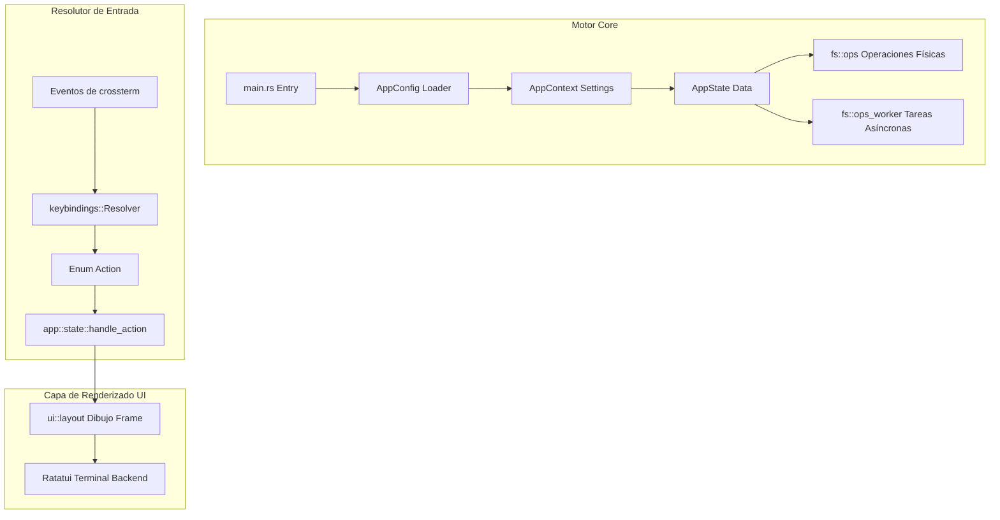
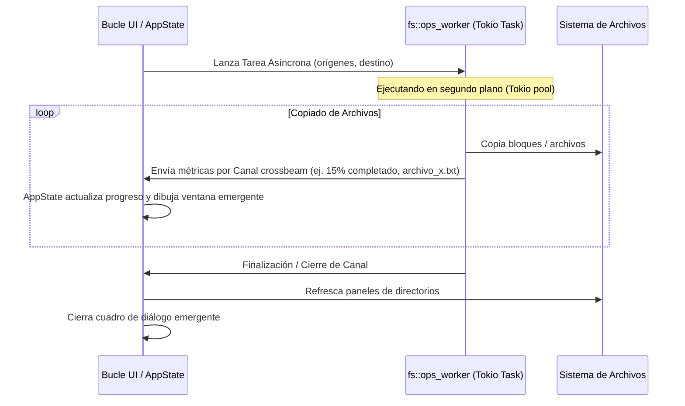

# Manual Técnico y de Arquitectura de Pairee

Este documento detalla el diseño de software, la organización de módulos, los flujos de ejecución y los patrones de desarrollo aplicados en el gestor de archivos **Pairee**.

---

## 🏛️ 1. Arquitectura Central y Estado Desacoplado

Pairee se rige bajo el principio fundamental de **separar estrictamente la lógica de negocio del motor de dibujado de la interfaz (TUI)**.



### 1.1 Estado Desacoplado de la Consola
El núcleo del gestor de archivos (lectura de directorios, ordenamientos, filtros de máscaras glob, procesos y colas de copiado) no importa librerías gráficas como `ratatui` ni interactúa con la salida de pantalla de forma directa.
* Todos los datos mutables se almacenan en `AppState` (`src/app/state/mod.rs`) y la configuración estática en `AppContext` (`src/app/context.rs`).
* Esto permite implementar pruebas unitarias rápidas de navegación, ordenación y selección sin requerir un emulador de terminal o mockeo de consola.

### 1.2 Bucle de Eventos Principal (`app::run`)
El flujo general de ejecución se comporta de la siguiente manera:
1. `main.rs` carga la configuración e inicializa `AppContext` y `AppState`.
2. `app::run()` activa el modo raw de la consola mediante `terminal::backend`.
3. Un bucle asíncrono monitoriza los eventos del sistema (pulsaciones de teclas y redimensionamientos) utilizando `terminal::events`.
4. El resolutor traduce la entrada de teclado en una acción de la aplicación.
5. El estado se modifica y se invoca la actualización visual (Redraw) en el siguiente ciclo.

---

## ⌨️ 2. Motor de Resolución de Atajos de Teclado

Pairee desacopla las teclas físicas de las acciones dentro de la UI usando perfiles de teclado configurables (`norton`, `vim`, `modern`).

### 2.1 Flujo de Resolución
Los eventos de teclado viajan en una única dirección:
1. `crossterm::event::KeyEvent` es capturado en el hilo principal.
2. El evento se envía al resolutor de atajos: `keybindings::resolver::resolve(key, active_preset)`.
3. El resolutor devuelve un tipo estructurado `keybindings::actions::Action`.
4. El gestor de estado procesa la acción lógica: `app::state::handle_action(action)`.

```rust
// Ejemplo de mapeo lógico en keybindings/resolver.rs
pub fn resolve(key: KeyEvent, preset: &str) -> Option<Action> {
    match preset {
        "vim" => resolve_vim_preset(key),
        "norton" => resolve_norton_preset(key),
        _ => resolve_modern_preset(key),
    }
}
```

---

## 🔄 3. Operaciones Asíncronas y Patrón Worker

Las tareas de lectura y escritura intensiva en disco (Copiar, Mover, Borrado Seguro, Eliminar) se delegan en un grupo de hilos de segundo plano administrados por `tokio` para evitar congelar la interfaz de usuario.



### 3.1 Ciclo del Canal de Progreso
* **Lanzamiento:** Cuando se dispara `Action::Copy`, el sistema invoca `fs::ops_worker::spawn_copy_task`.
* **Procesamiento:** El hilo de segundo plano procesa la creación de directorios, comprueba si los archivos de destino ya existen, lee y escribe búferes y actualiza estadísticas.
* **Notificación de Progreso:** Durante el copiado, el worker envía estados intermedios mediante una estructura:
  ```rust
  pub struct CopyProgress {
      pub current_file: String,
      pub files_copied: usize,
      pub total_files: usize,
      pub bytes_copied: u64,
      pub total_bytes: u64,
  }
  ```
* **Renderizado de Progreso:** En cada iteración gráfica de la UI, se leen los datos del canal y se actualiza la barra gráfica mediante el componente `ui::popup::prompts::render_prompt_popup`.
* **Cierre:** Al finalizar, el canal se cierra, indicándole al hilo principal que actualice la información de almacenamiento libre y los archivos visibles en pantalla.

---

## 🌐 4. Motor de Localización Centralizado

La traducción de la interfaz de usuario se implementa de manera estructurada para evitar la duplicación de literales y facilitar la traducción a nuevos idiomas.
* **Textos en Inglés por Defecto:** Todas las cadenas de texto nativas están centralizadas en `src/config/localization/en.rs` mediante la función `get_default_english_translation(key)`.
* **Archivos Externos:** Los idiomas adicionales se leen de forma dinámica desde ficheros JSON de traducción (por ejemplo, `lang/es.json`) en el arranque.
* **Acceso Simple:** Los componentes visuales de la aplicación obtienen las traducciones llamando a la macro o función `t("clave_de_traduccion")`. Si una traducción no se encuentra en el archivo cargado, se utiliza la cadena inglesa como alternativa por defecto.

---

## 🖥️ 5. Lanzador de Ventana Independiente (Standalone)

Pairee puede iniciarse de manera nativa sin requerir que el usuario abra una consola previamente:
* Al arrancar, `main.rs` ejecuta `terminal::standalone::check_and_launch_standalone()`.
* **En Windows:** Comprueba si el binario fue lanzado directamente desde el Explorador de Archivos (sin consola contenedora activa). De ser así, crea un proceso nuevo llamando a una instancia del terminal del sistema (`cmd.exe` o `powershell.exe`) configurando las dimensiones apropiadas y lanzando Pairee dentro de él.
* **En Linux/macOS:** Invoca un emulador de terminal instalado en el sistema (ej. `xterm`, `gnome-terminal`, `kitty`) pasándole como argumento el binario de Pairee.

---

## 🎨 6. Motor de Temas Visuales y Colores

* Los temas gráficos se configuran en archivos TOML independientes.
* Asocian elementos visuales lógicos (como bordes de paneles, archivos ejecutables o menús seleccionados) a constantes de color del terminal (ej. `Color::Blue` o `Color::Rgb(r,g,b)`).
* `ui::theme_apply::parse_color` se encarga de parsear las cadenas de texto del archivo TOML para convertirlas en estilos nativos de `ratatui::style::Color` que se inyectan dinámicamente en los componentes durante el frame actual.

---

## 🔄 7. Sistema de Actualización Automática

Pairee integra un sistema inteligente de detección y ejecución de actualizaciones de software, diseñado para funcionar sin interrupciones y adaptándose a múltiples plataformas y métodos de instalación.

### 7.1 Componentes del Módulo (`src/update/`)
El sistema está desacoplado en varios componentes de responsabilidad única:
* **Detector de Método (`detect.rs`):** Identifica cómo fue instalado Pairee en el sistema del usuario de entre 13 métodos (como gestores de paquetes nativos de Linux, gestores de paquetes de Windows, instalador Inno Setup, tar.gz manual o zip manual).
* **Verificador (`checker.rs`):** Consulta de forma asíncrona la API de GitHub Releases para comprobar si existe una versión superior usando ordenamiento semántico (`semver`). Implementa una caché local en disco (`update_cache.json`) que dura 1 hora para evitar superar los límites de rate limit de la API.
* **Descargador (`downloader.rs`):** Descarga el archivo ejecutable o comprimido correspondiente en segundo plano de manera segmentada/streaming, calculando en tiempo real el progreso de la descarga y validando la integridad del archivo comparando su hash SHA-256 con el archivo `.sha256` remoto.
* **Instalador (`installer.rs`):** Aplica la actualización dependiendo del método detectado. Para actualizaciones de binario directo (Linux tar.gz), realiza un reemplazo atómico. Para instaladores Windows (Inno Setup), lanza la instalación silenciosa. Para Windows zip manual, genera un script `.bat` temporal para reemplazar el archivo tras el cierre de Pairee. Para gestores de paquetes, presenta el comando de consola adecuado.

### 7.2 Flujo de Ejecución y Tareas Asíncronas
1. **Verificación en el arranque:** Si `auto_update_check` está activo, se lanza un hilo Tokio en segundo plano al arrancar la aplicación.
2. **Notificación no invasiva:** Si se detecta una versión más nueva, se dibuja un indicador amarillo `▲ UPDATE` en la barra visual de la UI.
3. **Diálogo interactivo:** Si el usuario selecciona el botón de actualizar en el menú Options o hace clic en el indicador, se abre un popup que muestra el registro de cambios (Changelog) y las opciones para "Instalar ahora", "Ignorar versión" (guarda la versión ignorada en el archivo de configuración para no volver a notificarla) o "Cerrar".
4. **Descarga e instalación en vivo:** Si se inicia la actualización, se abre un popup de progreso de descarga que actualiza en tiempo real los bytes transmitidos y, al finalizar la descarga e instalación con éxito, solicita al usuario reiniciar la aplicación.

