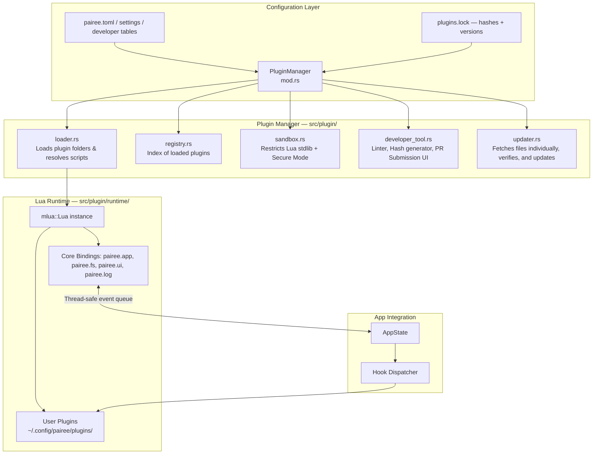
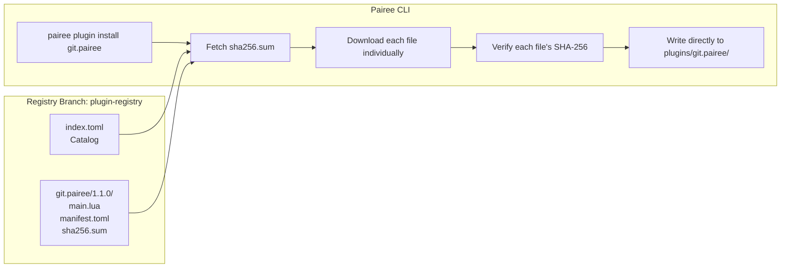

# Implementation Plan — Pairee Plugin System

> **Status: Planning only. No source-code changes are included.**

This document establishes the corrected and expanded architectural plan for a Lua-based plugin system for Pairee.

---

## User Review Required

> [!IMPORTANT]
> This plan is for architectural and planning purposes only. Implementation should happen in a future milestone. No code changes should be applied based on this document until the implementation milestone is explicitly started.

---

## Goals

| # | Goal |
|---|------|
| G1 | Allow community-developed Lua plugins to extend file previewing, navigation, and commands |
| G2 | Keep the Rust core untouched when adding/removing plugins at runtime |
| G3 | Maintain UI responsiveness — no plugin can block the rendering thread |
| G4 | Provide a folder-based distribution model where every file has a recorded SHA-256 hash |
| G5 | Enforce a strict Secure Mode and Trust Model to prevent malicious network egress |
| G6 | Support dynamic keybinding overlays packaged directly inside the plugin folder |
| G7 | Expose robust logging and debug interfaces for developers |
| G8 | Implement a built-in developer tool with PR submission UI (requires `developer_mode = true`) |

---

## Part 1 — Core Plugin Engine

### 1.1 Scripting Runtime Selection
* **Library:** `mlua` (with `luajit` or `vendored-lua` features for self-contained compilation).
* **Rationale:** Lua is lightweight, has extremely fast initialization, is memory efficient, and allows easy sandboxing. It avoids the heavy memory/execution overhead of JS engines or WebAssembly runtimes.

---

### 1.2 Architecture Overview



---

### 1.3 Design Patterns

* **Strategy Pattern (Plugin Types as Traits):** Plugins implement specific roles (`Previewer`, `Preloader`, `Hook`, `Command`) by defining corresponding methods in their returned Lua tables.
* **Observer Pattern (Pub/Sub Hook Bus):** `HookBus` handles event subscriptions (`on_cd`, `on_hover`, `on_key`) and notifies subscribers asynchronously on separate Tokio tasks.
* **Command Pattern (Functional Plugins):** Plugins map names to `entry()` functions which are registered in the global execution registry.
* **Facade Pattern (Core API Bindings):** The `pairee.*` global namespace acts as a facade hiding complex Rust objects from Lua.
* **Flyweight / Read Snapshot Pattern (State Sync):** Lua scripts read app state via read-only snapshots (`pairee.sync`) and write mutations through a typed event channel.

---

### 1.4 Module Structure

```text
src/
└── plugin/
    ├── mod.rs              # Public API surface — re-exports & initialization
    ├── manager.rs          # Discovers, loads, and tracks plugins
    ├── loader.rs           # Loads directory structures, executes main.lua
    ├── registry.rs         # Name → PluginHandle map
    ├── hooks.rs            # HookBus — event subscribe/emit dispatcher
    ├── sandbox.rs          # Sandbox configuration and Secure Mode enforcement
    ├── developer_tool.rs   # Formatting, validating, hashing, and PR Git client
    ├── updater.rs          # Registry fetch, update check, and search tools
    └── runtime/
        ├── mod.rs
        ├── standard.rs     # Lua VM initialization, global table setup
        ├── bindings/
        │   ├── mod.rs
        │   ├── app.rs      # pairee.app.* bindings
        │   ├── fs.rs       # pairee.fs.* bindings
        │   ├── ui.rs       # pairee.ui.* bindings
        │   ├── ps.rs       # pairee.ps.* pub/sub bindings
        │   └── log.rs      # pairee.log.* debugging bindings
        └── types/
            ├── mod.rs
            ├── entry.rs    # File/directory entry type exposed to Lua
            └── job.rs      # Preview/preload job context type
```

---

### 1.5 Dynamic Keybinding Overlays
Plugins declare default keybindings in their `manifest.toml` (or in a `keymaps.toml` file inside the plugin folder):

```toml
# In plugin's manifest.toml
[keybindings]
"ctrl+h" = "entry"          # Binds Ctrl+H directly to the plugin's entry() function
```

When a plugin is loaded, Pairee's keybinding resolver automatically merges these mappings as a dynamic overlay, eliminating the need for users to manually edit their global settings files.

---

### 1.6 Error Handling & Debugging

1. **Central Logging Bridge (`pairee.log`):**
   * Exposes `pairee.log.info(msg)`, `pairee.log.warn(msg)`, `pairee.log.error(msg)`, and `pairee.log.debug(msg)`.
   * Messages are routed directly to Pairee's native logger and saved to `~/.cache/pairee/app.log`.
2. **Error Interception:**
   * Runtime errors (e.g. nil exceptions, array bounds) are caught by Rust's `mlua::Error` boundary.
   * Panics do not crash the app; they trigger a visible notification toast indicating the failing plugin and line number, and log the backtrace.
3. **CLI Plugin Debug Mode:**
   * Running `pairee --plugin-debug <name>` launches Pairee and prints real-time console logs and runtime evaluation states of `<name>` directly to the stdout stream for testing.

---

### 1.7 Sandboxing & Network Protection

#### Trusted Mode (`trusted = true`)
Enables access to dangerous standard libraries (`io`, `os`, `package`) and permits running shell processes via `pairee.fs.spawn()`.

#### Untrusted Mode (`trusted = false`)
Runs the Lua script in a strict VM sandbox. Standard file IO, environment modification, and external command execution are blocked.

#### Secure Mode (`secure_mode = true` in pairee.toml)
To prevent malicious plugins from stealing local files and leaking them via the network, we introduce a global **Secure Mode**:
* This setting is defined in the main configuration file (`pairee.toml` under `[settings]`).
* **Critical Security Guard:** This setting cannot be altered or overwritten by Lua scripts (the configuration loader is read-only for Lua).
* When `secure_mode = true`:
  * All network requests are blocked.
  * Attempting to spawn system binaries with network capabilities (such as `curl`, `wget`, `nc`, `ssh`, or raw script interpreters) via `pairee.fs.spawn` is strictly blocked by the Rust runtime.
  * Access to TCP/UDP socket creation or HTTP requests at the standard library or Rust boundary is permanently disabled, even for plugins marked as `trusted = true`.

---

## Part 2 — Community Registry & Download System

### 2.1 Registry Architecture & Folder-Based Distribution
Plugins are distributed as raw folders in the `plugin-registry` branch. Every file within the folder has its SHA-256 hash recorded in a versioned `sha256.sum` or `checksums.toml` file.



---

### 2.2 Registry Branch Layout

The `plugin-registry` branch has the following directory structure:

```text
plugin-registry/
├── registry/
│   ├── index.toml                  # Master catalog containing version mappings
│   └── plugins/
│       ├── git.pairee/
│       │   ├── manifest.toml       # Public metadata
│       │   ├── 1.0.0/
│       │   │   ├── main.lua
│       │   │   ├── manifest.toml
│       │   │   └── sha256.sum      # Hashes for all files in v1.0.0
│       │   └── 1.1.0/
│       │       ├── main.lua
│       │       ├── manifest.toml
│       │       ├── utils.lua
│       │       └── sha256.sum      # Hashes for all files in v1.1.0
│       └── fzf.pairee/
│           └── ...
```

---

### 2.3 `registry/index.toml` Format

```toml
# Pairee Plugin Registry Index

[[plugins]]
name        = "git.pairee"
description = "Git status integration for file panels"
author      = "community"
latest      = "1.1.0"
versions    = ["1.0.0", "1.1.0"]

[[plugins.files]]
version = "1.1.0"
files = [
  { path = "main.lua", sha256 = "e3b0c44298fc1c149afbf4c8996fb92427ae41e4649b934ca495991b7852b855" },
  { path = "manifest.toml", sha256 = "fa25d4a298fc1c149afbf4c8996fb92427ae41e4649b934ca495991b7852b855" },
  { path = "utils.lua", sha256 = "c081d4a298fc1c149afbf4c8996fb92427ae41e4649b934ca495991b7852b855" }
]
```

---

### 2.4 CLI Plugin Commands (Search, List, and Updates)

| Command | Action |
|---------|--------|
| `pairee plugin list` | Lists installed plugins, versions, trust status, and flags available updates. |
| `pairee plugin search <query>` | Queries `index.toml` (locally cached) and displays matches by name, author, or tags. |
| `pairee plugin install <name>[@ver]` | Downloads files, verifies individual SHA-256 hashes, and writes them. |
| `pairee plugin check-updates` | Contacts the registry branch and lists available updates. |
| `pairee plugin update [--all]` | Updates installed plugins to the latest compatible SemVer version. |
| `pairee plugin remove <name>` | Deletes the plugin folder and cleans up entries from `plugins.lock`. |

---

## Part 3 — Developer Mode & Pull Request Submission UI

### 3.1 Developer Settings (`pairee.toml`)
To prevent cluttering the normal user experience, all developer commands and user interface screens are gated behind a developer flag.

```toml
# In pairee.toml
[developer]
developer_mode = true        # Defaults to false. Must be enabled to access dev tools.
github_token = "ghp_***"     # Optional securely stored PAT for PR submission.
```

---

### 3.2 Developer Tool CLI (`pairee developer`)
When `developer_mode = true`, a new subcommand suite is unlocked:
* `pairee developer format <path>`: Formats Lua scripts according to Pairee's standard formatting rules.
* `pairee developer validate <path>`: Lints scripts, checks `manifest.toml` schemas, and validates Lua syntax.
* `pairee developer package <path>`: Scans the directory, checks Lua file references, and automatically generates/updates the `sha256.sum` file with correct hashes for all files.

---

### 3.3 Automated PR Submission UI
An interactive developer-only TUI screen is added to request plugin incorporation or updates:

```
┌───────────────────────── Submit Plugin to Registry ────────────────────────┐
│                                                                            │
│  Plugin Path:  [ ~/.config/pairee/plugins/git.pairee                      ]│
│  Version:      [ 1.1.0 ]                                                   │
│                                                                            │
│  GitHub Username:     [ developer-handle                       ]           │
│  Personal Token (PAT):[ ************************************** ]           │
│  Developer Fork URL:  [ https://github.com/dev/Pairee          ]           │
│                                                                            │
│  PR Title:     [ Add git.pairee version 1.1.0                              ]│
│  Description:  [ Live Git status changes shown directly in side panels.   ]│
│                [                                                          ]│
│                                                                            │
│                [ Validate & Sign ]       [ Submit Pull Request ]           │
│                                                                            │
└────────────────────────────────────────────────────────────────────────────┘
```

#### **Submission Execution Flow:**
1. **Validation & Hashing:** The tool automatically formats all files, verifies syntax, generates the `sha256.sum`, and copies files into the correct registry structure (`registry/plugins/<name>/<version>/`).
2. **Git Branch Creation:** Using Git commands directly on the developer's cloned repository workspace:
   * Checks out a clean version of the `plugin-registry` branch.
   * Creates a new branch (e.g. `submit-git.pairee-1.1.0`).
   * Stages the new version directory and manifest changes, then commits them.
3. **Push & PR Generation:**
   * Pushes the branch to the developer's GitHub fork repository.
   * Dispatches a GitHub API HTTPS request to `FittyAr/Pairee` to automatically create a Pull Request targeting the official repository's `plugin-registry` branch.

---

## Verification Plan

### Manual Verification
* Validate the layout of the updated technical design documents.
* Check that all `.yazi` terms have been successfully replaced with `.pairee` or generic names.
* Ensure all documentation files listed are modified correctly.
